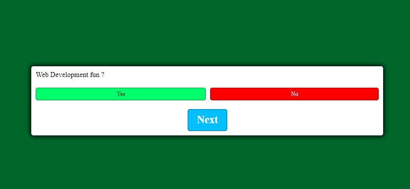
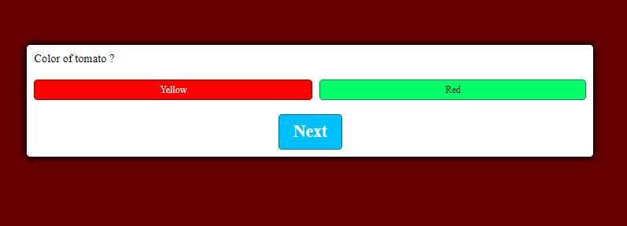

# JavaScript-quiz-game
A JavaScript quiz game that can take multiple answers and show the correct result to users

Includes data management and DOM manipulation
A set of questions that has two or four options.
Correct answers lets you know that it is correct with changing the background color accordingly 

